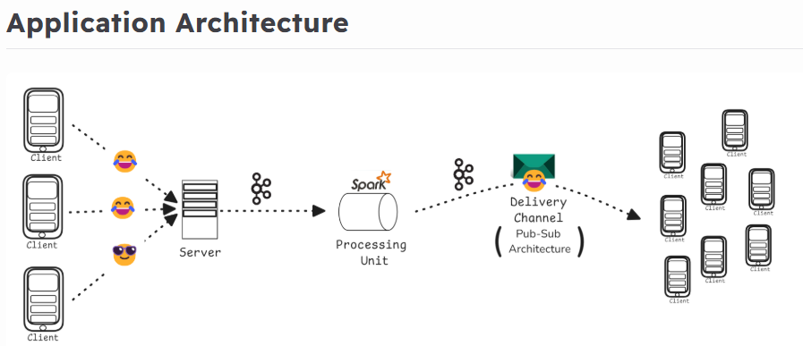

# EmoStream: Concurrent Emoji Broadcast over Event-Driven Architecture

## 🚀 Project Overview

EmoStream captures and processes billions of user-generated emojis in real-time during live sporting events. It reflects the dynamic sentiments of fans through a visually engaging emoji swarm. By leveraging an event-driven architecture and scalable technologies like **Kafka** and **Spark**, the system provides low-latency and high-concurrency support for live emoji broadcasting on platforms like Hotstar.

---

## 🎯 Goal

To design and implement a horizontally scalable system that:
- Captures real-time emoji reactions from users
- Processes and aggregates this data efficiently
- Streams the aggregated emoji data back to clients
- Supports millions of concurrent users with minimal latency

---

## 🧱 Application Architecture



### 1. Client Input → Kafka Queue
- A Flask API receives POST requests with:
  - `user_id`, `emoji_type`, `timestamp`
- Kafka Producer buffers and flushes data every 500ms

### 2. Stream Processing with Spark
- Kafka Consumer (Spark Streaming) processes micro-batches every 2 seconds
- Aggregation Algorithm:
  - For every 1000 emojis (or fewer) of the same type, reduce to 1 count

### 3. Real-time Delivery with Pub-Sub
- **Main Publisher** forwards aggregated data to clusters
- **Cluster Publisher** sends data to multiple **Subscribers**
- **Subscribers** relay updates to end-users in real time

---

## 📦 Final Deliverables

- ✅ Flask API to receive client data and asynchronously write to Kafka
- ✅ Kafka Producer with 500ms flush interval
- ✅ Spark Streaming job for 2-second micro-batches
- ✅ Aggregation algorithm reducing high-frequency emojis
- ✅ Pub-Sub system with main publisher, cluster publishers, and subscribers
- ✅ Scalable architecture supporting thousands of concurrent users

---

## 🧪 Testing

### Unit Testing:
- Test POST API with concurrent emoji submissions

### Load Testing:
- Simulate 200+ emoji reactions per second from multiple clients

---

## 🎬 Demo Setup

- Multiple threads simulate clients sending:
  ```json
  {
    "user_id": "123",
    "emoji_type": "🔥",
    "timestamp": "2025-07-11T19:00:00"
  }
